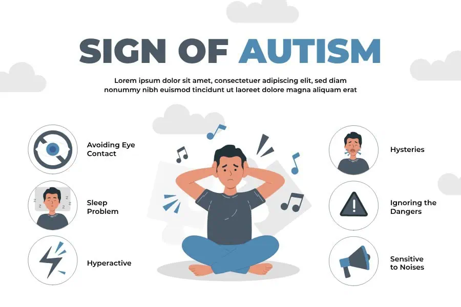

# Autism Spectrum Disorder (ASD) – Medical Analysis & ML Prediction System

## Project Overview

This project presents a data-driven approach to assist in the **early screening of Autism Spectrum Disorder (ASD)** in toddlers using behavioral and demographic data. Leveraging the **Autistic Spectrum Disorder Screening Data for Toddlers (July 2018)** dataset, we preprocess the data using **Apache Spark**, train machine learning models, and deploy an interactive prediction interface using **Streamlit**.

**Goal**: To build a fast, interpretable, and accessible tool that predicts potential ASD traits in toddlers based on Q-Chat-10 responses and demographic information.

---

##  Problem Statement

ASD diagnosis can be delayed due to high costs, limited clinical resources, and time-consuming procedures. Early detection is crucial for better outcomes. This project addresses these issues by:

- Utilizing machine learning for quick ASD risk classification.
- Processing data at scale with Apache Spark.
- Deploying a user-friendly interface for real-time predictions.

---
## 📄 Abstract: Existing System vs Proposed System

| **Aspect**                         | **Existing System**                                                                 | **Proposed System**                                                                                      |
|-----------------------------------|-------------------------------------------------------------------------------------|-----------------------------------------------------------------------------------------------------------|
| **Data Usage**                    | Limited use of toddler data for ASD detection.                                      | Uses real-world toddler datasets including age, QCHAT-10 score, family history, and more.                |
| **Diagnosis Method**              | Manual screening by clinicians using questionnaires.                                | Semi-automated data analysis to assist early detection using QCHAT-10 score trends.                      |
| **Data Cleaning**                 | Often lacks pre-processing for standardization.                                     | Applies data cleaning (e.g., string formatting, missing value handling) for better consistency.          |
| **Visualization**                 | Rarely visualizes correlation in public tools.                                      | Provides intuitive visualizations (bar plots, heatmaps) to show trends and insights.                     |
| **Family History Consideration**  | Not always considered systematically.                                               | Correlates ASD traits with presence/absence of family member with ASD.                                   |
| **Age Group Analysis**            | No detailed analysis by age bands.                                                  | Uses grouped age ranges to analyze ASD trends across different developmental stages.                     |
| **Accessibility**                 | Data insights not easily accessible to non-experts.                                 | Uses Python-based tools like pandas, seaborn, matplotlib to generate understandable insights.            |
| **Objective**                     | Primarily diagnostic without educational insights.                                  | Helps parents, researchers, and clinicians identify early patterns in toddlers’ behavior.                |
| **Scalability**                   | Not designed for batch analysis or future automation.                               | Easily scalable with integration into machine learning models or web dashboards (future scope).          |

## Dataset Information

- **Name**: Autistic Spectrum Disorder Screening Data for Toddlers
- **Source**: [Autism screening data for toddlers](https://www.kaggle.com/datasets/fabdelja/autism-screening-for-toddlers?resource=download)
- **Date**: July 22, 2018
- **Type**: Behavioral, Medical, Social
- **Attributes**:
  - Q-Chat-10 behavioral responses (A1–A10)
  - Age (in months)
  - Gender, Ethnicity
  - Born with jaundice (yes/no)
  - Family history of ASD (yes/no)
  - Score and final classification
---

##  Tech Stack

| Layer        | Tools & Libraries                      |
|--------------|----------------------------------------|
| Language     | Python 3.13                            |
| Data Engine  | pandas                                 |
| ML Libraries | scikit-learn (RandomForestClassifier)  |
| Deployment   | Streamlit (interactive web app)        |
| Visualization| matplotlib                             |
| Testing      | pytest (unit test in `test_app.py`)    |
| Versioning   | Git, GitHub                            |

---

##  Workflow

### 1. Data Preprocessing (Apache Spark)
- Load and clean the dataset using PySpark DataFrames.
- Convert categorical and binary features to numerical.
- Feature selection and label encoding via Spark ML pipelines.

### 2. Exploratory Data Analysis
- Distribution of ASD vs. non-ASD cases.
- Feature correlation heatmaps.
- Visual trends by age, gender, etc.

### 3. Machine Learning Modeling
- Train models: Logistic Regression, Random Forest, Gradient Boosting.
- Evaluate with Accuracy, Precision, Recall, F1-score, ROC-AUC.

### 4. Deployment
- Build a **Streamlit app** that:
  - Accepts user input for all Q-Chat-10 + demographic features.
  - Displays predicted ASD risk (Yes/No) with a probability score.
  - Optionally shows feature contributions and insights.

---

## How to Run the Project

###  Prerequisites
- Python 3.13
- pip or conda
- Git

## Some important things to be noted.
## Q-CHAT-10 Scoring Guide
The Q-CHAT-10 (Quantitative Checklist for Autism in Toddlers - 10 item version) is a brief, validated screening tool designed to identify early signs of autism in toddlers aged 18 to 30 months.

# Scoring System:
- The questionnaire contains 10 Yes/No questions.
- Some items are reverse-scored.

- Each response contributes 0 or 1 point to the total score.

The total score ranges from 0 to 10.

## Interpretation:
## Total Score	Screening Outcome
- 0 – 2	Negative screen – Low likelihood of autism
- ≥ 3	Positive screen – Elevated likelihood of autism; further evaluation recommended
- ⚠️ Important: The Q-CHAT-10 is a screening tool, not a diagnostic test. A score of 3 or more indicates that the child may benefit from a comprehensive diagnostic assessment by a qualified healthcare professional.

## Usage Notes:
- Best suited for toddlers aged 18–30 months.

- Designed for early identification of social-communication difficulties and repetitive behaviors.

- Can be used in clinical settings, research, or community-based screening programs.

## From the Heat-Map that was generated the insgihts that was found useful are :

**12-18 Months**:
- Predominantly light yellow cells (scores around -4 to -15) suggest lower QCHAT-10 scores, indicating fewer or less pronounced ASD traits. This aligns with the idea that autism symptoms may be subtler or harder to detect in younger toddlers.

**18-24 Months**:
- A transition zone with more orange hues (-15 to -25), reflecting an increase in higher QCHAT-10 scores. This age range is a critical window for autism screening, as many diagnostic signs (e.g., social communication delays) become more apparent.a

**24-36 Months**:
- Darker red cells (-30 to -45) dominate, indicating a higher prevalence of elevated QCHAT-10 scores. This could suggest that ASD traits are more detectable or severe in this age group, consistent with developmental progression and increased screening sensitivity.

## ASD traits in toddlers vs Family History of ASD

**From The Graph**:
-- It is observed that the toddlers with ASD and Family History of ASD doesn't have that common siginficance on each other. Both the traits may be consider independent of esch other.

-- The toddlers with ASD. Their family History of ASD has less significant.
